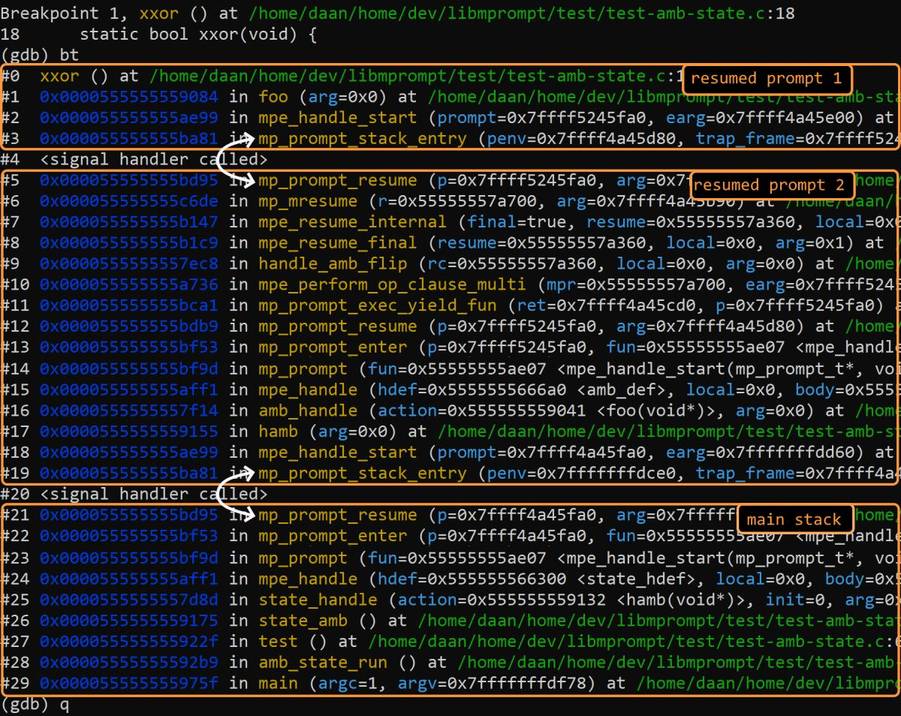
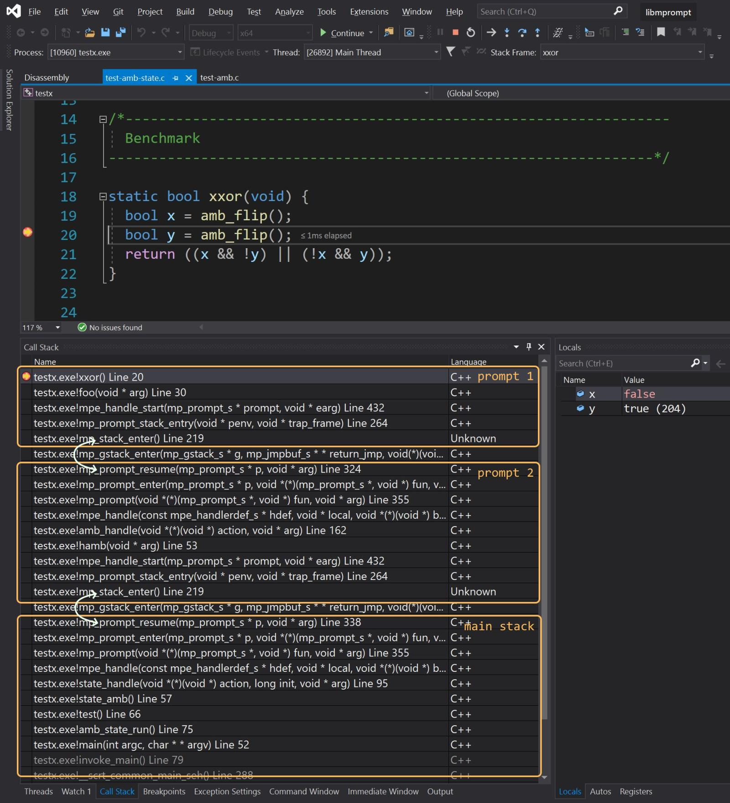

# libmprompt


_Note: The library is under development and not yet complete. This library should not be used in production code._  
Latest release: v0.4, 2021-04-04.

A 64-bit C/C++ library that aims to implement robust and efficient multi-prompt delimited control. 

The implementation is based on _in-place_ growable light-weight gstacks (called `gstack`s) which use 
virtual memory to enable growing the gstack (up to 8MiB) but start out using 
just 4KiB of committed memory. The library is only available 
for 64-bit systems (currently Windows, Linux, macOS, and various BSD's) 
as smaller systems do not have enough virtual address space.

There are two libraries provided:

- `libmprompt`: the primitive library that provides multi-prompt delimited control. 
  The multi-prompt abstraction has well-defined semantics and is the
  minimal control abstraction that can be typed with simple types.
  As such, we view the `libmprompt` library as a good API that should be provided
  by the OS or language runtime to provide generic and sound delimited control.
  `libmpromptx` is the C++ compiled variant that integrates exception handling
  where exceptions are propagated correctly through the gstacks.
  
- `libmpeff`: a small example library that uses `libmprompt` to implement
  efficient algebraic effect handlers (with a similar interface as [libhandler]).
  This is an easier abstraction to program with using multi-prompts directly.

Particular aspects:

- The goal is to be fully compatible with C/C++ semantics and to be able to
  link to this library and use the multi-prompt abstraction _as is_ without special
  considerations for signals, stack addresses, unwinding etc. 
  In particular, this library has _address stability_: using the in-place 
  growable gstacks (through virtual memory), these stacks are never moved, which ensures 
  addresses to the stack are always valid (in their lexical scope) -- to the C program
  it still looks as if there is just one large stack. There is
  also no special function prologue/epilogue needed as with [split stacks][split]
  for example.
  
- The multi-prompt abstraction has a precise [semantics] and is well-typed. 
  Moreover, it guarantees there is always just one logical active stack (as a chain of
  gstacks) which allows exceptions to propagate naturally and also provides
  natural [backtraces] for any resumed prompt.

- A drawback of our implementation is that it requires 64-bit systems in order to have enough
  virtual address space. Moreover, at miminum 4KiB of memory is committed per 
  (active) prompt. On systems without "overcommit" we use internal _gpools_ to 
  still be able to commit stack space on-demand using a special signal handler.   

- We aim to support millions of prompts with fast yielding and resuming. If we run
  the [`mp_async_test1M`](test/main.c#L82) test we simulate an asynchronous
  service which creates a fresh prompt on each "connection", enters it and then suspends it
  (simulating waiting for an async result).
  Later it is resumed again where it calls a function that consumes 32KiB stack space, 
  and finally returns. The test simulates 10 million connections with 10000 suspended 
  prompts at any time:
  ```
  run 10M connections with 10000 active at a time, each using 32kb stack...
  total stack used: 312500.000mb, count=10000000
  elapsed: 0.932s, user: 0.883s, sys: 0.049s, rss: 42mb, main rss: 39mb
  ```
  This is about 10M "connections" per second (single threaded, Ubuntu 20, AMD5950X),
  where each connection creates a fresh prompt and context switches 4 times.


Enjoy,
  Daan Leijen and KC Sivaramakrishnan.

Releases:
- 2021-04-04: `v0.4`: initial support for Linux arm64.
- 2021-04-03: `v0.3`: better backtraces on Windows, support libunwind.
- 2021-04-01: `v0.2`: improved debugging on macOS with `lldb`.
- 2021-03-30: `v0.1`: initial release.


[split]: https://gcc.gnu.org/wiki/SplitStacks
[libhandler]: https://github.com/koka-lang/libhandler
[backtraces]: #backtraces
[semantics]: #semantics

# Building

Tested on Linux (amd64 and arm64), macOS (amd64), and Windows (amd64).

## Linux and macOS

We use `cmake` to build:

```
> mkdir out/debug    # or out/release
> cd out/debug
> cmake ../..
> make
> ./mptest
```

This will build the libraries `libmpromptx.a` and `libmpeffx.a`.

Pass the option `cmake ../.. -DMP_USE_C=ON` to build the C versions of the libraries
(but these do not handle- or propagate exceptions).

## Windows

We use Visual Studio 2019 to develop the library -- open the solution 
in `ide/vs2019/libmprompt.sln` to build and test.

## Issues

Some known issues are:

- `gdb`, `lldb`: when debugging (with _gpools_ enabled) on Linux you may see 
  segmentation fault errors (`SEGV`) which happen when demand paging stack memory; 
  you need to continue through those or set the debugger to ignore them 
  (enter `handle SIGSEGV nostop` in `gdb`).
  
- `lldb`: debugging on macOS has no such issue, but in debug mode we use an extra thread
  to handle Mach exceptions (to avoid a long standing [bug](https://bugs.llvm.org//show_bug.cgi?id=22868) in `lldb`).
  
- On Windows with MSVC you need to compile with `-EHa` to unwind exceptions reliably. 
  Backtraces in Visual Studio (and `windbg`) work well but sometimes the debugger stops 
  a backtrace too soon when libmprompt is unable to put a gstack at a lower address than its parent.


# Libmprompt C Interface

```C
// Types
typedef struct mp_prompt_s  mp_prompt_t;     // resumable "prompts"
typedef struct mp_resume_s  mp_resume_t;     // abstract resumption

// Function types
typedef void* (mp_start_fun_t)(mp_prompt_t*, void* arg); 
typedef void* (mp_yield_fun_t)(mp_resume_t*, void* arg);  

// Continue with `fun(p,arg)` under a fresh prompt `p`.
void* mp_prompt(mp_start_fun_t* fun, void* arg);

// Yield back up to a parent prompt `p` and run `fun(r,arg)` 
void* mp_yield(mp_prompt_t* p, mp_yield_fun_t* fun, void* arg);

// Resume back to the yield point with a result; can be used at most once.
void* mp_resume(mp_resume_t* resume, void* arg);
void* mp_resume_tail(mp_resume_t* resume, void* arg);
void  mp_resume_drop(mp_resume_t* resume);
```

```C
// Multi-shot resumptions; use with care in combination with linear resources.
void*        mp_yieldm(mp_prompt_t* p, mp_yield_fun_t* fun, void* arg);
mp_resume_t* mp_resume_dup(mp_resume_t* r);

// Portable backtrace
int mp_backtrace(void** backtrace, int len);
```


# Backtraces

A nice property of muli-prompts is that there is always
a single strand of execution, together with suspended prompts.
In contrast to lower level abstractions, like fibers, there is no 
arbitrary switching between stacks: one can only yield up to a
parent prompt (capturing all gstacks up to that prompt) or 
resume a suspended prompt chain (and restoring all gstacks in that context).
As a consequence, the active chain of prompts always form a logical stack 
and we can have natural propagation of exceptions with proper backtraces.

Here is an example of a backtrace on Linux:



Here a breakpoint was set in code that was resumed
where the backtrace continues into the main stack. This is quite nice
for debugging compared to callback based programming for example.

Here is a backtrace in the Visual Studio debugger:



(Unfortunately, on Windows, in rare cases a backtrace can still be cut short 
when libmprompt is unable to place a gstack at a lower address as its parent.)


# Semantics

The semantics of delimited multi-prompt control 
can be described precisely:

Syntax:
```ioke
e ::= v              ; value
   |  e e            ; application
   |  yield m v      ; yield to a prompt identified by marker `m`
   |  prompt v       ; start a new prompt (passing its marker to `v`)
   |  @prompt m e    ; internal: a prompt frame identified by marker `m`

v ::= x              ; variables
   |  \x. e          ; function with parameter `x` (lambda expression)
   |  ...            ; integer constants, primitives (e.g. addition), etc.
```

Evaluation context:
```ioke
E ::= []            ; hole
   |  E e           ; evaluate function first
   |  v E           ; and then the argument 
   |  @prompt m E   ; we can evaluate under a prompt frame
```
An evaluation context is an expression with a hole at the current point in the 
evalution. It essentially describes the stack+registers where the hole is the current instruction pointer.
We can apply a context to an expression using square bracets `E[x]`; 
for example, `(@prompt m (f (g [])))[x]` becomes `@prompt m (f (g x))`.

Operational semantics:
```ioke
              e ----> e'
(STEP)    -----------------
          E[e] |----> E[e']    
```

We can now keep evaluating inside an expression context using small step transitions:
```ioke
(APP)      (\x. e) v                ---->  e[x := v]                ; beta-rule, application
(PROMPT)   prompt v                 ---->  @prompt m (v m)          ; install a new prompt with a fresh marker `m`
(RETURN)   @prompt m v              ---->  v                        ; returning a result discards the prompt frame
(YIELD)    @prompt m E[yield m f]   ---->  f (\x. @prompt m E[x])   ; yield to prompt frame `m`, capturing context `E`
```

Note how in `(YIELD)` we yield with a function `f` to a prompt `m`. This
continues with executing `f` (popping the prompt) but with the argument
`\x. @prompt m E[x]` which is the resumption function: calling it will
restore the prompt and the original execution
context `E` (!), and resume execution at the original yield location.
For example:

```ioke
       prompt (\x. 1 + yield x (\k. k 41))            
|----> @prompt m ((\x. 1 + yield x (\k. k 41)) m)     ; fresh marker `m`
|----> @prompt m (1 + yield m (\k. k 41))             ; note: `\k. k 41` is the function that is yielded up
==     @prompt m ((1 + [])[yield m (\k. k 41)])       ; yield back up to `m`, capturing E
|----> (\k. k 41) (\x. @prompt m (1 + [])[x])         ; continue with the function of the yield
|----> (\x. @prompt m (1 + [])[x]) 41                 ; resume by applying `k`
|----> @prompt m ((1 + [])[42])                       ; resumed to the yield with result 42
==     @prompt m (1 + 42)
|----> @prompt m 43
|----> 43
```

In the C implementation, the unique markers `m` are simply
represented directly by a `mp_prompt_t*`.
At runtime, yielding to a prompt that is no longer in scope, 
or to a prompt that is not an ancestor (i.e. not in your
evaluation context), is an error (e.g. like an unhandled exception).
(Effect type systems, like in [Koka], can prevent this situation
statically at compile-time but in our library this is a runtime error).

These primitives are very expressive but can still be
typed in in simply typed lambda calculus, and are sound and
composable:
```haskell
prompt :: (Marker a -> a) -> a               
yield  :: Marker a -> ((b -> a) -> a) -> b   
```

The action given to `prompt` gets a marker that has 
a type `a`, corresponding to the type of the current context `a` (the _answer_ type).
When yielding to a marker of type `a`, the yielded function has type `(b -> a) -> a`,
and must return results of type `a` (corresponding to the marker context).
Meanwhile, the passed in resumption function `(b -> a)` expects an argument
of type `b` to resume back to the yield point. Such simple types cannot be 
given for example to any of `shift`/`reset`, `call/cc`, fibers, or co-routines, 
which is one aspect why we believe multi-prompt delimited control is preferable.

The growable gstacks are used to make capturing- and resuming
evaluation contexts efficient. Each `@prompt m` frame sits
on the top a gstack from which it can yield and resume 
in constant time. This can for example be used to create
green thread scheduling, exceptions, iterators, async-await, etc.

For a more in-depth explanation of multi-prompt delimited control,
see "_Evidence Passing Semantics for Effect Handler_", Ningning Xie and Daan Leijen, MSR-TR-2021-5 
([pdf](https://www.microsoft.com/en-us/research/publication/generalized-evidence-passing-for-effect-handlers/)).


# An implementation based on in-place growable stacks

Each prompt starts a growable gstack and executes from there.
For example, we can have:
```ioke
(gstack 1)              (gstack 2)              (gstack 3)

|-------------|
| @prompt A   |
|-------------|
|             |
| ...         |
| prompt <------------> |-------------|
|             |         | @prompt B   | 
.             .         |-------------|
.             .         |             |
.             .         | ...         |         
                        | prompt <------------> |------------|
                        .             .         | @prompt C  |
                        .             .         |------------|
                        .             .         | 1+         |
                                                | yield B f  |<<<
                                                .            .
                                                .            .
```   
where `<<<` is the currently executing statement.

The `yield B f` can yield directly to prompt `B` by
just switching stacks. The resumption `r` is also
just captured as a pointer and execution continues
with `f(r)`: (rule `(YIELD)` with `r` = `\x. @prompt B(... @prompt C. 1+[])[x]`)
```ioke
(gstack 1)              (gstack 2)              (gstack 3)

|-------------|
| @prompt A   |
|-------------|
|             |
| ...         |         (suspended)
| resume_t* r ~~~~~~~~> |-------------|
| f(r)        |<<<      | @prompt B   | 
.             .         |-------------|
.             .         |             |
.             .         | ...         |         
                        | prompt <------------> |------------|
                        .             .         | @prompt C  |
                        .             .         |------------|
                        .             .         | 1+         |
                                                | []         |
                                                .            .
                                                .            .
```   

Later we may want to resume the resumption `r` again with
the result `42`: (`r(42)`)

```ioke
(gstack 1)              (gstack 2)              (gstack 3)

|-------------|
| @prompt A   |
|-------------|
|             |
| ...         |         (suspended)
| resume_t* r ~~~~~~~~> |-------------|
|             |         | @prompt B   | 
| ...         |         |-------------|
| resume(r,42)|<<<      |             |
.             .         | ...         |         
.             .         | prompt <------------> |------------|
.             .         .             .         | @prompt C  |
                        .             .         |------------|
                        .             .         | 1+         |
                                                | []         |
                                                .            .
```   
Note how we grew the gstack 1 without moving gstack 2 and 3.
If we have just one stack, an implementation needs to copy 
and restore fragments of the stack (which is what [libhandler] does),
but that leads to trouble in C and C++ where stack addresses can temporarily become invalid.
With the in-place growable gstacks, objects on the stack are never moved
and their addresses stay valid (in their lexical scope).

Again, we can just switch stacks to resume at the original
yield location: 
```ioke
(gstack 1)              (gstack 2)              (gstack 3)

|-------------|
| @prompt A   |
|-------------|
|             |
| ...         |         
| resume_t* r ~~~~~+--> |-------------|
|             |    |    | @prompt B   | 
| ...         |    |    |-------------|
| resume <---------+    |             |   
|             |         | ...         |         
.             .         | prompt <------------> |------------|
.             .         .             .         | @prompt C  |
                        .             .         |------------|
                        .             .         | 1+         |
                                                | 42         |<<<
                                                .            .
                                                .            .
```

Suppose, gstack 3 now returns normally with a result 43:

```ioke
(gstack 1)              (gstack 2)              (gstack 3)

|-------------|
| @prompt A   |
|-------------|
|             |
| ...         |         
| resume_t* r ~~~~~+--> |-------------|
|             |    |    | @prompt B   | 
| ...         |    |    |-------------|
| resume <---------+    |             |   
|             |         | ...         |         
.             .         | prompt <------------> |------------|
.             .         .             .         | @prompt C  |
                        .             .         |------------|
                        .             .         | 43         |<<<
                                                .            .
                                                .            .
```

Then the gstacks can unwind like a regular stack (this is
also how exceptions are propagated):  (rule `(RETURN)`)

```ioke
(gstack 1)              (gstack 2)              (gstack 3)

|-------------|
| @prompt A   |
|-------------|
|             |
| ...         |         
| resume_t* r ~~~~~+--> |-------------|
|             |    |    | @prompt B   | 
| ...         |    |    |-------------|
| resume <---------+    |             |   
|             |         | ...         |         
.             .         | 43          |<<<      (cached to reuse)
.             .         .             .         |------------|
                        .             .         |            |
                        .             .         |            |
                                                .            .
                                                .            .
```

See [`mprompt.c`](src/mprompt/mprompt.c) for the implementation of this.


## An Example

Here is a minimal example of running `N` "async" workers over `M` requests
using resumptions as first-class values stored in the `workers` array:

```C
#include <stdio.h>
#include <stdint.h>
#include <mprompt.h>

#define N 10000       // max active async workers
#define M 10000000    // total number of requests

static void* await_result(mp_resume_t* r, void* arg) {
  return r;  // instead of resuming ourselves, we return the resumption as a "suspended async computation" (A)
}

static void* async_worker(mp_prompt_t* parent, void* arg) {
  // start a fresh worker
  // ... do some work
  intptr_t partial_result = 0;
  // and await some request; we do this by yielding up to our prompt and running `await_result` (in the parent context!)
  mp_yield( parent, &await_result, NULL );
  // when we are resumed at some point, we do some more work 
  // ... do more work
  partial_result++;
  // and return with the result (B)
  return (void*)(partial_result);
}

static void async_workers(void) {
  mp_resume_t** workers = (mp_resume_t**)calloc(N,sizeof(mp_resume_t*));  // allocate array of N resumptions
  intptr_t count = 0;
  for( int i = 0; i < M; i++) {  // perform M connections
    int j = i % N;               // pick an active worker
    // if the worker is actively waiting (suspended), resume it
    if (workers[j] != NULL) {  
      count += (intptr_t)mp_resume(workers[j], NULL);  // (B)
      workers[j] = NULL;
    }
    // and start a fresh worker and wait for its first yield (suspension). 
    // the worker returns its own resumption as a result.
    if (i < (M - N)) {
      workers[j] = (mp_resume_t*)mp_prompt( &async_worker, NULL );  // (A)
    }
  }
  printf("ran %zd workers\n", count);
}

int main(int argc, char** argv) {
  async_workers();
  return 0;
}
```


# The libmpeff Interface

A small library on top of `libmprompt` that implements
algebraic effect handlers. Effect handlers give more structure
than basic multi-prompts and are a better abstraction for
programming. In particular, 

- You do not need the particular prompt marker, but always
  yield to the innermost handler for a particular effect. This 
  is much more convenient and is essential for example model
  dynamically bound state (much like implicit parameters).

- All potential operations are bound statically at the handler
  and you always yield to a particular operation providing arguments
  (where the handler definition is basically a v-table with a slot for every operation).
  This makes it easier to reason about than using a multi-prompt
  yield which can yield with any arbitrary function.

- As effect handlers are linked on the stack, this abstraction
  can be used across libraries/languages and is thus more
  composable than using multi-prompts directly.

See [`effects.c`](test/effects.c) for many examples of common 
effect patterns.

```C
// handle an effect 
void* mpe_handle(const mpe_handlerdef_t* hdef, void* local, mpe_actionfun_t* body, void* arg);

// perform an operation
void* mpe_perform(mpe_optag_t optag, void* arg);

// resume from an operation clause (in a mp_handler_def_t)
void* mpe_resume(mpe_resume_t* resume, void* local, void* arg);
void* mpe_resume_final(mpe_resume_t* resume, void* local, void* arg);
void* mpe_resume_tail(mpe_resume_t* resume, void* local, void* arg); 
void  mpe_resume_release(mpe_resume_t* resume);
```

Handler definitions:

```C
// An action executing under a handler
typedef void* (mpe_actionfun_t)(void* arg);

// A function than handles an operation receives a resumption
typedef void* (mpe_opfun_t)(mpe_resume_t* r, void* local, void* arg);

// Operation kinds can make resuming more efficient
typedef enum mpe_opkind_e {
  ...
  MPE_OP_TAIL,          
  MPE_OP_GENERAL      
} mpe_opkind_t;

// Operation definition
typedef struct mpe_operation_s {
  mpe_opkind_t opkind;  
  mpe_optag_t  optag;   
  mpe_opfun_t* opfun; 
} mpe_operation_t; 

// Handler definition
typedef struct mpe_handlerdef_s {
  mpe_effect_t      effect;         
  mpe_resultfun_t*  resultfun;     
  ...
  mpe_operation_t   operations[8];
} mpe_handlerdef_t;
```

[Koka]: https://koka-lang.github.io
